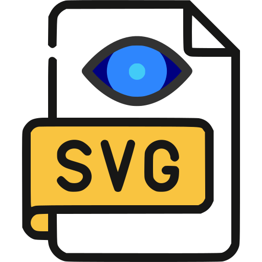

#  SVG Viewer

A simple SVG file viewer application built with wxPython. This application allows users to view SVG files with a main canvas display and a thumbnail strip for easy navigation.

## ✨ Features

- **SVG Display**: Renders SVG files in a scalable canvas with a checkerboard background to indicate transparency.
- **Thumbnail Navigation**: Displays thumbnails of loaded SVG files in a scrollable strip at the bottom.
- **File Management**: Open individual SVG files or entire folders containing SVG files.
- **Drag & Drop Support**: Drag and drop SVG files or folders directly into the application.
- **Keyboard Navigation**: Navigate through SVG files using arrow keys or thumbnail selection.
- **Menu Options**: File menu for opening files and folders, with standard exit functionality.

## � Installation

1. Ensure you have Python 3.x installed on your system.
2. Install the required dependencies:
   ```
   pip install wxPython
   ```
3. Clone or download the project files.
4. Run the application:
   ```
   python main.py
   ```

## 📖 Usage

- Launch the application by running `main.py`.
- Use the File menu to open SVG files or folders.
- Alternatively, drag and drop SVG files or folders into the window.
- Navigate through the loaded SVG files using the thumbnail strip or keyboard arrows.
- The main canvas displays the currently selected SVG file.

## 📦 Dependencies

- wxPython: For the GUI framework and SVG rendering capabilities.

## 🚀 Improvement ideas

Here are a few ideas of future improvements for this application:

- Add zoom and pan controls (toolbar buttons + keyboard shortcuts) for better navigation.
- Persistent "Recent files/folders" list and support session restore on launch.
- Add export to PNG/JPEG/SVG rasterization and printing support.
- Improve thumbnail caching and asynchronous rendering for large file sets.
- Provide theme support (dark mode) and UI scaling for high-DPI displays.

## ⚖️ License

This project is open-source and free, provided by Xav', and available under the Creative Commons Attribution-NonCommercial-ShareAlike 4.0 International License.

<p style="text-align: center"><a href="https://creativecommons.org/licenses/by-nc-sa/4.0/"></a>></p>
